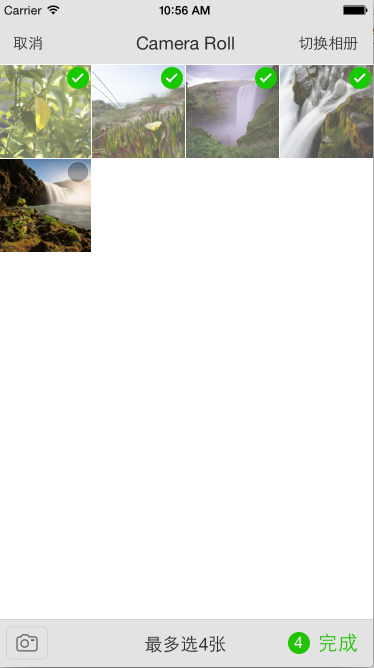

    Charlin出框架的目标：简单、易用、高度封装、绝对解耦！

#CorePhotoPickerVCManager
####大统一的多功能照片选取器，集成拍摄，单选，多选。

##框架特性： 
>1.无需代理，无需解析数据，传一个type值，block就把图片对象给你！ 
>2.支持相册目录（后期支持视频选取）。 
>3.支持iPhone6/iPhone6 Plus及横竖屏。 
>4.支持相册直接拍摄、相册选取（单选），相册多选 
>5.相册多选支持最少选取张数，最多选取张数，并带有超出选取自动提示。 
>6.界面专业设计，界面美观。 
>7.支持设备不可用block回调。 
>8.整个使用过程你不再需要设置代理，全部使用block回调。 
>9.您如果需要不同的选取功能，直接在初始化的时候指定type即可 

##重要定义：
    typedef enum{
    
            //用户拍照
            CorePhotoPickerVCMangerTypeCamera=0,
            
            //单张照片选取
            CorePhotoPickerVCMangerTypeSinglePhoto,
            
            //多张照片选取
            CorePhotoPickerVCMangerTypeMultiPhoto,
            
            //视频选取（暂不考虑，本框架仍可以完美支持）
            CorePhotoPickerVCMangerTypeVideo,
    
    }CorePhotoPickerVCMangerType;

    typedef enum{
    
            //无错误,可用
            CorePhotoPickerUnavailableTypeNone,
            
            //相机不可用
            CorePhotoPickerUnavailableTypeCamera,
            
            //相册不可用
            CorePhotoPickerUnavailableTypePhoto,
            
    }CorePhotoPickerUnavailableType;
    
    
#使用示例：

    CorePhotoPickerVCManager *manager=[CorePhotoPickerVCManager sharedCorePhotoPickerVCManager];
    
    //设置类型
    manager.pickerVCManagerType=type;
    
    //最多可选3张
    manager.maxSelectedPhotoNumber=3;
    
    //错误处理
    if(manager.unavailableType!=CorePhotoPickerUnavailableTypeNone){
        NSLog(@"设备不可用");
        return;
    }
    
    UIViewController *pickerVC=manager.imagePickerController;
    
    //选取结束
    manager.finishPickingMedia=^(NSArray *medias){
        
        [medias enumerateObjectsUsingBlock:^(CorePhoto *photo, NSUInteger idx, BOOL *stop) {
            NSLog(@"%@",photo.editedImage);
        }];
    };
    
    [self presentViewController:pickerVC animated:YES completion:nil];

#看看效果图吧：

    

-----
    CorePhotoPickerVCManager 大统一的多功能照片选取器，集成拍摄，单选，多选。
-----

  

#### 版权说明 RIGHTS  
作品说明：本框架由iOS开发攻城狮Charlin制作。 
作品时间： 2015.01.02 23:50 
更新时间： 2015.03.03 15:14  

#### 关于Chariln INTRODUCE  
作者简介：Charlin-四川成都华西都市报旗下华西都市网络有限公司技术部iOS工程师！  

#### 联系方式 CONTACT  
Q    Q：1761904945（请注明缘由） 
Mail：1761904945@qq.com 
